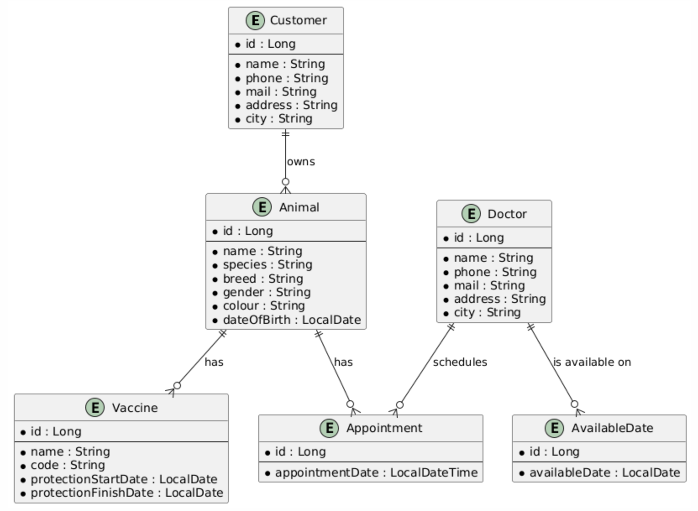

Of course. Here is the `README.md` content in English, strictly following the format you provided. It is ready for you to copy and paste.

---

<div align="center">
  

  <h1>🐾 Veterinary Management System</h1>

  <p style="max-width:650px; margin:auto; text-align:center;">
    <strong>Veterinary Management System</strong>  is a RESTful API built with Spring Boot, designed to serve as the backend for a veterinary clinic's operational needs. It provides a complete set of endpoints for handling customers, pets, doctors, appointments, and vaccination records efficiently.
  </p>
</div>

---

## 📘 Table of Contents
- [Project Overview](#project-overview)
- [Features](#features)
- [Architecture](#architecture)
- [Database Schema](#database-schema)
- [Requirements](#requirements)
- [How to Build & Run](#how-to-build--run)
- [Configuration](#configuration)
- [Badges](#badges)
- [Contact](#contact)

---

## Project Overview
**Veterinary Management System** is an extendable and modular clinic management system developed as a final project for Patika.dev
The system provides a RESTful API for managing all core aspects of a veterinary clinic, from patient records to doctor scheduling, using a robust backend built with the Spring Framework.

---

## Features
- 👥 **Customer Management:** Add, update, and view pet owner details.
- 🐾 **Animal Management:** Manage patient records, including species, breed, age, and color.
- 👨‍⚕️ **Doctor Management:** Maintain a registry of doctors and manage their available workdays.
- 📅 **Appointment System:** Schedule and manage appointments between doctors and animals.
- 💉 **Vaccine Tracking:** Record and track vaccination details for each animal, including protection start and end dates.

---

## Architecture
The project follows a **Layered Architecture** to ensure separation of concerns and improve maintainability:

| Layer | Description |
|-------|--------------|
| **Controller (API) Layer** | Handles incoming HTTP requests and exposes RESTful endpoints. |
| **Service Layer** | Contains the core business logic, validation, and coordinates repository access. |
| **Repository Layer** | Manages data persistence and communication with the PostgreSQL database using Spring Data JPA. |
| **Entity & DTO Layer** | Defines the domain objects (Entities) and Data Transfer Objects for API communication. |

---

## Database Schema
The database schema illustrates the relationships between the core entities of the system.



*(Note: This image should be generated from the PlantUML file and placed in the `/docs` directory.)*

---

## Requirements
Make sure you have the following installed:

| Requirement | Version / Description |
|--------------|-----------------------|
| **Java** | 21 (OpenJDK or Oracle JDK) |
| **Spring Boot**| 3.5.6 |
| **Maven** | 4.0+ |
| **PostgreSQL**| Database |

---

## How to Build & Run

### 1️⃣ Clone the repository
```bash
git clone https://github.com/your-username/vetManagement.git
```

### 2️⃣ Navigate to the project directory
```bash
cd vetManagement
```

### 3️⃣ Build the project with Maven
```bash
mvn clean install
```


---

## Configuration
Database connection details can be configured in the `src/main/resources/application.properties` file.


---

## 🛠️ Badges
<p align="center">
  
  
  
  
  
</p>

## 📫 Contact

For questions, suggestions, or contributions, feel free to reach out:
📧 sarperkaya01@gmail.com

<div align="center">
  Made with ❤️ by <strong>Sarper Kaya</strong>
</div>